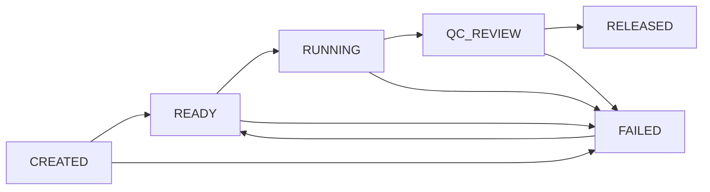
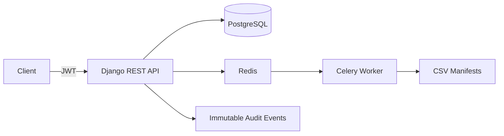

# Assay Run Orchestrator

Portfolio API for coordinating synthetic assay runs through auditable states, recording quality-control metrics, and generating asynchronous CSV manifests.

This project was designed from scratch as a public demonstration of common operational-backend patterns. It does not contain client code, patient data, real laboratory rules, report layouts, or organization-specific workflows.

## What it demonstrates

- Multi-organization access with `ADMIN`, `OPERATOR`, and `VIEWER` memberships
- JWT-authenticated Django REST API with organization-scoped querysets
- Explicit assay-run state machine with transactional transitions
- Immutable audit events for run creation, state changes, QC metrics, and exports
- QC metrics with configurable lower/upper limits and computed pass status
- Celery background jobs that generate organization-scoped CSV manifests
- PostgreSQL, Redis, Docker Compose, OpenAPI/Swagger, automated tests, and CI

## State flow



## Architecture



## Quickstart

```bash
cp .env.example .env
docker compose up --build -d
docker compose exec web python manage.py seed_demo
```

Open Swagger UI at `http://127.0.0.1:8000/api/docs/`.

Demo users all use password `demo1234`:

- `demo-admin`
- `demo-operator`
- `demo-viewer`

## Main endpoints

- `POST /api/auth/token/`
- `GET /api/me/`
- `GET/POST /api/runs/`
- `POST /api/runs/{id}/transition/`
- `GET/POST /api/qc-metrics/`
- `GET/POST /api/exports/`
- `GET /api/audit-events/`

## Local validation

```bash
python -m venv .venv
source .venv/bin/activate
pip install -r requirements.txt
python manage.py migrate
python manage.py test
python manage.py spectacular --file /tmp/openapi.yaml --validate
```

## Confidentiality boundary

All names, identifiers, metrics, workflows, and demo credentials in this repository are synthetic. The project intentionally avoids patients, clinical results, real assay rules, client branding, and private report templates.
